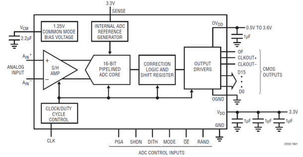
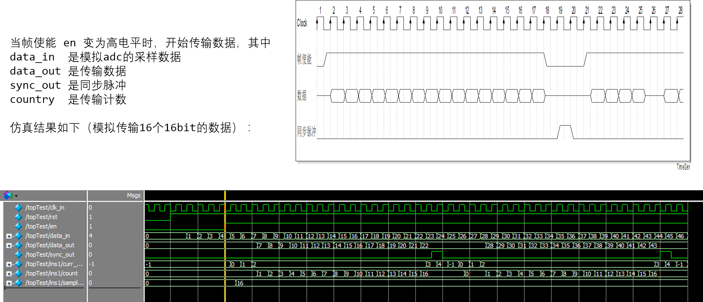

> Author：zyl

> Date：2018/8/4


# 基于Camera link接口的16通道低噪声AD技术

### FPGA采用xilinx公司的XC6SLX100FG676，在FPGA内需要设计
1. **AD芯片的控制程序**
1. **AD采样程序**
1. **同步数据输出**
1. 数据分析程序
1. Camera link接口程序
1. **同步信号生成模块**


---
- AD采样与采样同步时钟同步
- AD采样后输出的数据需要与采样同步时钟同步
---


### ADC数据传输模块接口定义：

```
module adcDateSend(
    input    wire               clk,
    input    wire               reset_n,    
    
    input    wire               en,         //帧使能
    input    wire    [15: 0]    dataIN,     //采样数据
    input    wire    [3 : 0]    sampleMode, //采样数量设置
    
    output   reg     [15: 0]    dataOUT,    //数据输出
    output   reg                sync        //脉冲信号
);
```

### ADC控制模块接口定义：

```
module adcControl(
    input         clk,
    input         reset_n,
    
    output        PGA,
    output        SHDN,
    output        DITH,
    output [1:0]  MODE, 
    output        OE,
    output        RAND
);

```
定义参考如下：



### 仿真：
[点击查看 测试代码](code/adcDateSend.v)

### 仿真结果：




